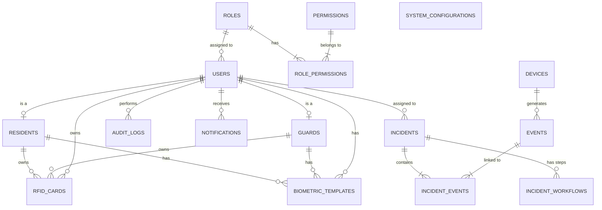

# Database Schema Documentation

## Overview

This schema is designed for a comprehensive physical security and access control system. It uses PostgreSQL and leverages UUIDs for primary keys to ensure global uniqueness and scalability.

## Entity-Relationship Diagram (ERD)

## Tables & Relationships

### 1. Identity & Access Management (RBAC)

*   **`users`**: Central identity table. Handles authentication.
*   **`roles`**: Defines user roles (e.g., Admin, Guard, Resident).
*   **`permissions`**: Granular access control flags.
*   **`role_permissions`**: Many-to-many link between roles and permissions.

### 2. Personnel & Residents

*   **`residents`**: Profiles for building residents. Can be linked to a `user` account for app access.
*   **`guards`**: Profiles for security staff. Linked to `user` accounts for system access.

### 3. Credentials

*   **`rfid_cards`**: Physical access cards. Can be assigned to a resident, guard, or generic user. Constraint ensures a card belongs to only one entity.
*   **`biometric_templates`**: Stores biometric data references (e.g., face embedding, fingerprint hash). Similar ownership constraints as RFID cards.

### 4. Device Management

*   **`devices`**: Inventory of cameras, sensors, and controllers. Stores configuration and status.

### 5. Monitoring & Events

*   **`events`**: High-volume table for all system events (motion detected, card swipe, error).
    *   *Note*: Designed for high write throughput.
*   **`incidents`**: actionable security occurrences that require tracking and resolution.
*   **`incident_events`**: Link specific events to an incident for evidence/context.
*   **`incident_workflows`**: Steps required to resolve an incident, potentially assigned to different roles/users.

### 6. System

*   **`notifications`**: Queue for alerts sent to users via Email/SMS/Push.
*   **`audit_logs`**: Immutable record of administrative actions (who changed what).
*   **`system_configurations`**: Dynamic system settings.

## Indexing Strategy

*   **Primary Keys**: All tables (except join tables) use UUIDs or BigInts with primary key indexes.
*   **Foreign Keys**: Standard B-tree indexes should be added to FK columns used frequently in joins (e.g., `user_id`, `device_id`).
*   **Time-Series Data**:
    *   `events(occurred_at)`: Essential for range queries (e.g., "show me events from last hour").
    *   `audit_logs(created_at)`: For history viewing.
*   **Lookups**:
    *   `users(email)`, `users(username)`: Unique indexes for fast login lookups.
    *   `rfid_cards(card_number)`: Fast validation of access cards.
    *   `devices(status)`: Quickly find offline devices.

## Retention Policies

To maintain performance and manage storage costs, the following retention policies are recommended:

1.  **Events**: **90 Days**. High-volume raw data. Aggregated stats should be computed for longer-term storage if needed.
2.  **Audit Logs**: **1 Year**. Required for compliance and security auditing.
3.  **Notifications**: **30 Days**. Transient data; history is rarely needed long-term.
4.  **Incidents**: **Indefinite**. These are legal records of security breaches or issues.
5.  **Biometrics/User Data**: Retained as long as the user/resident is active. Deleted immediately upon account termination (GDPR/Privacy compliance).

## Migration Guide

To apply the schema:
1.  Ensure PostgreSQL is installed with `uuid-ossp` extension available.
2.  Run the SQL files in `database/migrations/` in alphanumeric order.
3.  Run the seed scripts in `database/seeds/` to populate initial data.
