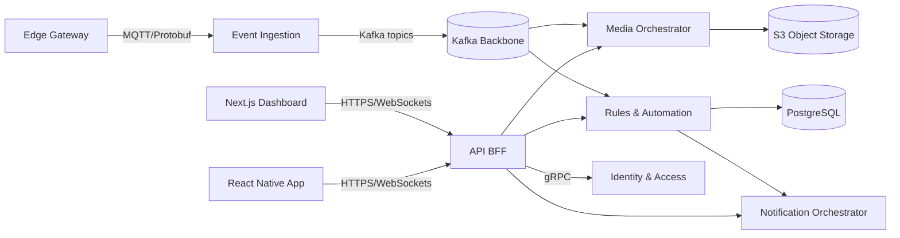

# Building Security Platform — System Architecture

## 1. Vision & Scope
The building security platform unifies CCTV feeds, physical sensors, biometric access, and notification channels into a single operations experience. It must deliver sub-second alerting, strong tenant isolation, and unified policy management for field devices, a command-center dashboard, and a guard/mobile experience.

## 2. Architectural Goals
- **Zero-trust security** with centralized identity (OAuth2/OIDC), least-privilege RBAC, and end-to-end encryption.
- **Real-time situational awareness** through event-driven ingestion, WebSockets, and offline-capable mobile clients.
- **Composable integrations** for CCTV vendors, sensors, biometrics, and notification providers via pluggable adapters.
- **Cloud-native operability** (Kubernetes, autoscaling, IaC) with multi-environment parity and CI/CD automation.
- **Auditability & compliance**: immutable logs, data retention controls, and encryption at rest.

## 3. Deployment Model
- **Primary runtime**: Multi-tenant Kubernetes clusters (EKS/GKE) deployed per region; blue/green strategy for releases.
- **Core services** run as containers; stateful workloads (PostgreSQL, Redis, Kafka) use managed services (AWS RDS, Elasticache, MSK) with cross-AZ replication.
- **Edge layer**: Optional on-prem edge gateway (containerized agent) for bandwidth-sensitive CCTV and sensor buffering; communicates to cloud via MQTT over TLS 1.3.
- **Network segmentation**: Public ingress (API Gateway + WAF) → service mesh (Istio/Linkerd) → private services + databases in separate subnets.

### Deployment Diagram
```mermaid
flowchart TB
    subgraph Clients
        W[React/Next.js Command Center]
        M[React Native Guard App]
        I[3rd-party Integrations]
    end

    subgraph Edge
        EG[Edge Gateway]
        BD[Building Devices]
    end

    W -->|HTTPS/WebSockets| AGW[API Gateway + WAF]
    M -->|HTTPS/WebSockets| AGW
    I -->|OAuth2 Client Credentials| AGW
    EG -->|MQTT/TLS| IGW[Ingestion Service]
    BD -->|RTSP/ONVIF, Modbus, BACnet| EG

    subgraph Kubernetes Cluster
        AGW --> BFF[API BFF (NestJS)]
        BFF --> AS[AuthN/AuthZ Service]
        BFF --> ESVC[Event Services]
        BFF --> RMS[Rules & Automation]
        BFF --> NTFY[Notification Orchestrator]
        ESVC --> Kafka[(Kafka/MSK)]
        RMS --> Redis[(Redis Cache)]
        BFF --> PG[(PostgreSQL/RDS)]
    end
```

## 4. Logical Service Boundaries
| Service | Key Responsibilities | Tech |
| --- | --- | --- |
| **Identity & Access** | OAuth2/OIDC federation, JWT minting, policy evaluation, tenant-level RBAC | Keycloak/Auth0, NestJS policy engine |
| **Device & Integration Hub** | Manage sensors, CCTV connectors (RTSP/ONVIF), biometric SDKs, health monitoring | NestJS microservice + gRPC adapters |
| **Event Ingestion** | Stream telemetry via MQTT/WebSockets, normalize, fan-out to Kafka topics | NestJS microservice, Kafka, protobuf |
| **Event Processing & Rules** | CEP pipelines, incident correlation, SLA timers | NestJS, Kafka Streams/Flink, Redis for rule state |
| **Command Center API BFF** | Aggregates backend services for web/mobile, enforces resource scoping | NestJS GraphQL + REST |
| **Notifications** | Orchestrates SMS, push, email, voice, incident webhooks | NestJS, provider SDKs (Twilio, SNS, FCM) |
| **Media Orchestrator** | Handles CCTV transcoding, stream tokenization, WebRTC relays | Go/Node service, S3 for clip storage |
| **Analytics & Reporting** | Aggregated metrics, compliance exports | dbt + BigQuery/Snowflake |

### Service Interaction Diagram


## 5. Data Flow
1. Devices and CCTV streams publish to the **Edge Gateway**, which performs protocol translation and buffering.
2. The **Event Ingestion** service authenticates edge clients via mutual TLS, normalizes payloads, and produces Kafka events.
3. **Event Processing** consumes topics, enriches with device metadata (PostgreSQL), executes rules, and persists incidents.
4. **Command Center BFF** exposes REST/GraphQL and WebSockets to dashboards and mobile clients for live updates.
5. **Notification Orchestrator** dispatches multi-channel alerts, honoring user preferences and escalation policies.
6. Historical data flows into the analytics warehouse nightly for BI and compliance exports.

## 6. Technology Stack
- **Backend**: NestJS monorepo (Nx) with microservices, TypeScript, gRPC, WebSockets, GraphQL.
- **Datastores**: PostgreSQL (primary relational), Redis (caching/session), Kafka (stream backbone), S3-compatible object storage for media, optional TimescaleDB for telemetry.
- **Frontend**: React/Next.js (command center + admin), Tailwind/Chakra UI, Mapbox GL for geospatial overlays.
- **Mobile**: React Native (guards & responders) with offline storage (SQLite + Redux Toolkit Query cache) and push messaging.
- **Infrastructure**: Kubernetes (EKS/GKE), Terraform modules, Istio service mesh, OpenTelemetry, Prometheus + Tempo + Grafana.
- **CI/CD**: GitHub Actions, reusable workflows per service, automated IaC plan/apply via Atlantis/Spacelift.

## 7. Integration Strategy
### CCTV Streams
- Support RTSP/ONVIF ingest via Edge Gateway; convert to HLS/WebRTC for dashboards using media orchestrator.
- Token-based playback URLs signed via JWT to prevent replay; optional cloud recording to S3 with lifecycle rules.

### Sensors (IoT, BACnet, Modbus, Zigbee)
- Protocol adapters inside Device & Integration Hub; normalized telemetry schema published to Kafka.
- Device provisioning via secure bootstrap (X.509 certificates) and remote firmware management pipeline.

### Biometrics
- SDK-specific adapters containerized separately; templates stored encrypted with hardware-backed keys (KMS + HSM).
- Enrollment workflows triggered via mobile app with liveness detection; compliance with GDPR/CCPA data minimization.

### Notification Providers
- Provider-agnostic orchestrator with pluggable drivers for SMS (Twilio), Push (FCM/APNs), Email (SES), voice (Twilio Voice), and incident webhooks.
- Retries, backoff, and delivery analytics persisted to PostgreSQL + time series metrics.

## 8. Security & Compliance Controls
- **Identity**: OAuth2/OIDC with PKCE for SPAs, client credentials for server-to-server, short-lived JWT access tokens (15 minutes) and refresh tokens (24 hours) bound to device.
- **RBAC**: Attribute-based policy engine (Casbin/OPA) enforcing tenant, site, and role scopes.
- **Encryption**: TLS 1.3 for all transport, AES-256/GCM for data at rest, envelope encryption via KMS, key rotation every 90 days.
- **Secrets**: Managed via Vault/Secrets Manager; inject via CSI driver.
- **Network**: WAF, API Gateway rate limiting, mutual TLS between services (Istio), private subnets for data stores.
- **Compliance**: Audit logging (append-only), SIEM forwarding (CloudWatch → Splunk), vulnerability scanning (Snyk/Trivy) baked into CI.

## 9. Observability & Reliability
- **Tracing/metrics/logs** via OpenTelemetry collectors, Prometheus, Loki, Grafana. SLOs (99.5% API availability, <2s alert latency).
- **Chaos & resilience**: automated failover drills, congestion control on edge connections, circuit breakers in BFF.
- **Backups & DR**: Point-in-time restore for PostgreSQL, Kafka snapshotting, cross-region disaster recovery warm standby.

## 10. CI/CD Workflow
1. PRs trigger unit + integration tests, lint, type-check, and IaC validation.
2. Security gates: dependency scanning, secret detection, container image scanning.
3. On merge, build & push images (tagged by SHA), run smoke tests in staging, then progressive delivery (Argo Rollouts) to production clusters.
4. Mobile releases leverage Expo EAS/fastlane with automated beta distribution; web deploys via Next.js static export + CDN invalidation.

## 11. Non-Functional Requirements
- **Latency**: Websocket updates <500 ms for critical alarms.
- **Scalability**: 100k concurrent device connections per region; multi-tenant isolation via per-tenant Kafka topics.
- **Availability**: Target 99.9% overall, relying on multi-AZ deployments and circuit breakers.
- **Maintainability**: Shared libraries for DTOs/schemas via Nx, automated contract tests between services.

## 12. Roadmap Alignment
See `../roadmap.md` for a sequenced delivery plan covering backend services, web dashboards, and mobile clients.
