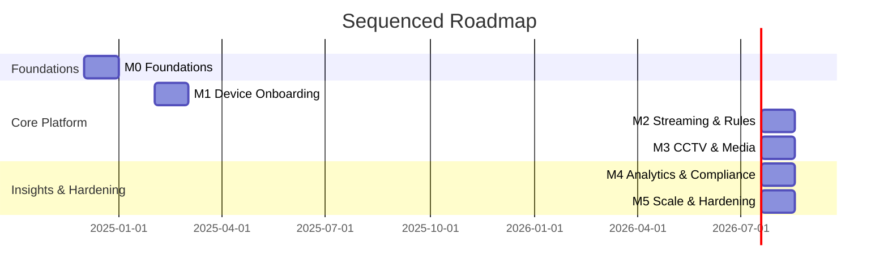

# Building Security Platform — Sequenced Delivery Roadmap

## Guiding Principles
- Deliver platform slices that are usable end-to-end (device → alert → response) every milestone.
- Keep backend, web, and mobile workstreams synchronized via shared milestones and API freeze checkpoints.
- Instrument everything from the outset (observability, security baselines, IaC) to avoid retrofits.

## Milestone Overview
| Milestone | Target | Backend Focus | Web (Next.js) | Mobile (React Native) | Key Dependencies |
| --- | --- | --- | --- | --- | --- |
| **M0 – Foundations** | Month 0‑1 | Bootstrap Nx monorepo, CI/CD pipelines, Terraform baseline, identity provider integration, seed PostgreSQL schema | Create component library scaffolding, auth shell, initial map layout | Setup project scaffolding, navigation, auth wiring, OTA update pipeline | ADRs finalized, design system tokens, secrets management |
| **M1 – Device Onboarding Slice** | Month 2 | Device & Integration Hub MVP, MQTT ingest, asset registry CRUD APIs | Device inventory views, onboarding wizard, realtime status indicators | Device enrollment/checklist workflows, push notifications for device health | Edge gateway agent, certificate issuance, hardware lab |
| **M2 – Event Streaming & Rules** | Month 3 | Kafka backbone, rules engine v1, incident storage, notification orchestrator MVP | Incident feed, rule builder UI (beta), notification preference management | Guard alert inbox, acknowledge/resolve actions, offline caching of incidents | Telemetry schema registry, Twilio/FCM sandbox accounts |
| **M3 – CCTV & Media** | Month 4 | Media orchestrator, WebRTC playback APIs, recording lifecycle to S3, RBAC scopes for streams | Multi-camera wall, PTZ controls, clip review & export | Mobile live view with adaptive bitrate, background audio alerts | GPU-enabled workers, CDN/WebRTC infra, security hardening of media paths |
| **M4 – Analytics & Compliance** | Month 5 | Data warehouse exports, scheduled reports, audit log APIs, SIEM forwarding | Compliance dashboards, trend charts, export center | Supervisor reporting views, schedule adherence tracking | BI tooling (dbt/Snowflake), retention policies |
| **M5 – Scale & Hardening** | Month 6 | Multi-region DR, autoscaling policies, chaos testing, penetration testing fixes | Accessibility audits, localization, advanced search | Offline-first guard tour mode, biometric enrollment toolkit | Production readiness review, SOC2 evidence collection |

## Cross-Cutting Workstreams
1. **Security & Compliance:** Run threat modeling each milestone, extend RBAC scopes as new features land, automate evidence capture.
2. **Observability:** Enforce SLO dashboards per service, add synthetic monitoring for dashboards/mobile endpoints.
3. **Developer Experience:** Maintain shared schema packages, expand contract tests as APIs stabilize, introduce feature flags for gradual rollout.

## Decision & Dependency Timeline

## Coordination Cadence
- **API Freeze** at the end of each milestone to allow web/mobile consumers to upgrade without breaking changes.
- **Demo + Ops Review** to validate device → alert → notification flow before promoting to the next environment.
- **Security Gates** (threat model + pen test delta review) before any GA promotion.

## Exit Criteria by Track
- **Backend:** Each milestone ships container images, Helm charts, and Terraform modules promoted through sandbox → staging → prod with automated smoke tests.
- **Web:** Dashboards meet performance budgets (<2s TTI on broadband) and include feature-flagged beta experiences before GA.
- **Mobile:** React Native app provides OTA fallback, background notifications, and offline ergonomics validated via field tests.
